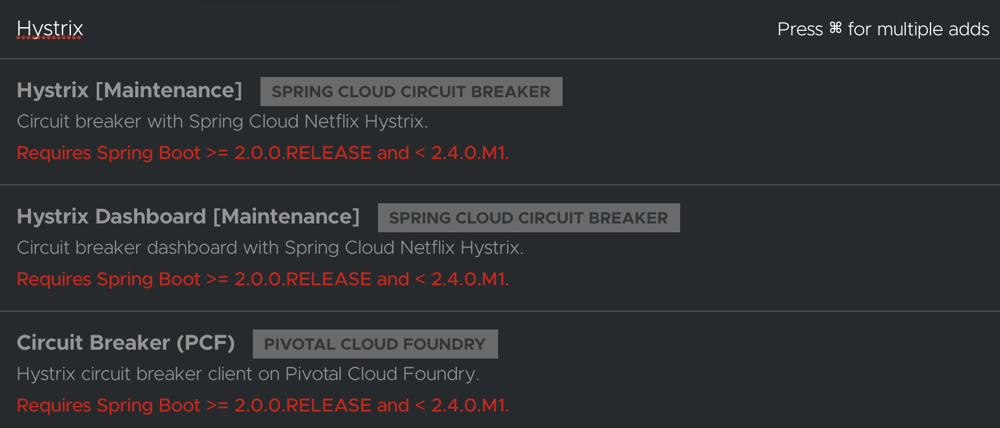

# Resilience4j

- CircuitBreaker
- Bulkhead
- RateLimiter
- Retry
- TimeLimiter
- Cache

##  Hystrix vs Resilience4j

### Hystrix
>[2. module  in Maintenance](https://github.com/spring-cloud/spring-cloud-netflix#2-modules-in-maintenance-mode) - Placing a module in maintenance mode means that the Spring Cloud team will no longer be adding new features to the module. We will fix blocker bugs and security issues, and we will also consider and review small pull requests from the community.

- netfix 기반의 spring-start-netfix 모듈은 유지 관리 모드에 놓여 있다. 이는 해당 라이브러리를 유지관리만 하며 새로운 개발을 하지 않는다는 것을 의미한다.

- hystrix는 외부 API 요청을 HystrixCommand로 wrapping해서 사용해야 한다.
    + [Posting](https://swiftymind.tistory.com/111?category=701477)
    + [hystrix code in use mysql + redis](https://github.com/chulman/websocket-sockjs/blob/circuitbreaker/spring-server/src/main/java/com/chulm/websocket/spring/server/domain/repository/MessageCacheRepository.java)

### Resilience4j
> Resilience4j is a lightweight, easy-to-use fault tolerance library inspired by Netflix Hystrix.
- resilience4j는 Hystrix로부터 영감을 받은 fault tolerance library이며, hystrix에 비해 몇몇 더 나은 점이 존재한다.
    + 가볍고, hystrix에 비해 사용하기가 정말 쉽다.
    + RxJava operators를 지원한다.
    + Resilience4j는 요청의 수행 횟수와 threshold 값을 설정할 수 있다.
      
### Chaos Monkey

- https://techcrunch.com/2012/07/30/netflix-open-sources-chaos-monkey-a-tool-designed-to-cause-failure-so-you-can-make-a-stronger-cloud/      
- 인스턴스 장애에 대해 탄력적인 서비스를 구현할 수 있도록 프로덕션에서 인스턴스를 무작위로 종료하도록 하는 장치
- de.codecentric:chaos-monkey-spring-boot 라이브러리는 실행중인 스프링 부트 app을 지속적으로 공격한다.

-  circuit breaker 를 적용하고 나서 chaos money 테스트를 통해 얼만큼 장애에 탄력적으로  대응할 수 있는지 점검한다.  

### TODO
- [ ]  resilience4j circuitBreaker 구성
- [ ]  resilience4j circuitBreaker with webflix 구성
- [ ]  jmeter test
- [ ]  chaos money test

### 참고

- https://spring.io/blog/2019/04/16/introducing-spring-cloud-circuit-breaker
- https://resilience4j.readme.io/docs/
- https://resilience4j.readme.io/docs/getting-started-3
